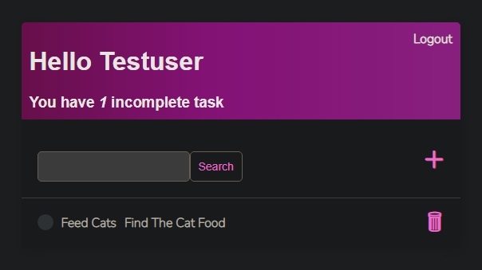
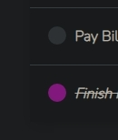

# **The_To_do_list**

by

Christa Cooper

**My Nucamp Honors project**

for

**Backend, SQL, and DevOps with Python**

it is hosted on Digital Ocean at https://seashell-app-uw9gu.ondigitalocean.app/

So I will be honest I struggled with a project.  I started several different projects and decided that they were not for me at the time.  So I admit I looked around for ideas online.  I came across a youtube programmer named Vitor Freitas [https://simpleisbetterthancomplex.com/]() and he was able to explain things in ways that made sense in my head.  So I set out on a journey to create the app based on things I learned from him.  Yes he does teach people how to make a similar app, and I did watch his video, he explains how the different parts interact and made this project feel reachable.  Now you may say just doing a type-along does not count as my project.  I did not do a type-along I took different thing I learned from him and turned it into something, I put in the time to make this my code, and even made many improvements to make it better.

The challenges I came across were many, but the main things I dealt with in this version were:

* The greeting - I wanted the task_list.html to greet the user by the first name if it was given, or the username(the default) if the first name was not set.
  * The solution - I spent so much time in the Django docs and watch a few videos online, and found I could write if statements just like python.  So a little format change and I was talking the Django language and I was writing an If statement to make it print the greeting by the first name if there was one given.  Here is an example without the first name in the profile.
  * 
* The description - I wanted the descriptions shown on the task_list.html page
  * The solution - Django docs are very, very complete but for someone that does not know Django you sometimes have to try several things before you find the right thing, but I was able to find how to format the request to display the information by linking to the task and requesting the description via the {{ }} expression

I feel like I have learned millions of things in this version of the project and for version 2 I want to make it so much better.

* The icons that change color when the item is marked complete - I would like to make them a clickable button that updates the state of the task to match the state of the button.
  * 
* Due dates - I would like to add due dates and have it do notifications for tasks that are due.
* Registration form - I would like to customize the registration form, from the standard UserCreationForm so that it asks the user for their first name, so it will display the first name of the User on the task_list.html
  * 
* Description field - I want to make better use of the description field, including rendering it on task_list.html how I would want it and making the information part of the notifications.
  * 

## **My video Notes**

Hi, my name is christa cooper and this is my To-do list honor project for November 2022 Backend python graduation.

It is a Django-based app, with HTML and CSS pages to keep track of To-Do tasks.  It uses many Django packages, including login, forms, mixins, and views.  As you can see it is a dashboard for tasks.  

(log-out) it has user authentication, so it could be used by many people say in a household. 

(register) so it also includes a way to register new users. 

(login) As you can see every page looks the same, that was handled by creating the main template and applying it to all the pages, so changes are global.

It greets the User by name and the number of incomplete tasks.

(use search) There is a fully functional search feature.

(hit add) You can add tasks with the plus sign. (make task)

(open task)You can also complete a task with the check mark and it will cross it off.(complete task)

(delete task) If you are ready to purge it from the list you can hit the trash can and it will delete it.

My biggest challenge was I did not know Django a week ago, but I was having trouble getting my python projects to do what I wanted and an internet search showed me that Django had the resources to make what I wanted if I learned how to use it.  So I scoured the docs, went thru a lot of trial ad error, consulted many smart people I know, and even found a pretty good expert that has videos that explained things in a way that made sense.

My favorite part of my code is where I figured out how to display the incomplete tasks to the user.  (switch between users) I figured out how to use a pluralizer and have it recognize how many tasks a user had and use the proper grammar.

Thank you for viewing my project coming up in version 2 there will be a custom registration page, due dates with notifications, and better use of the task description.

Goodbye
